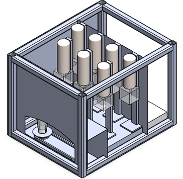
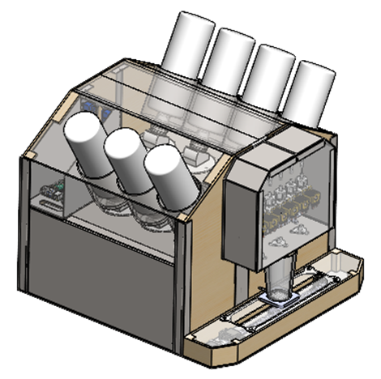
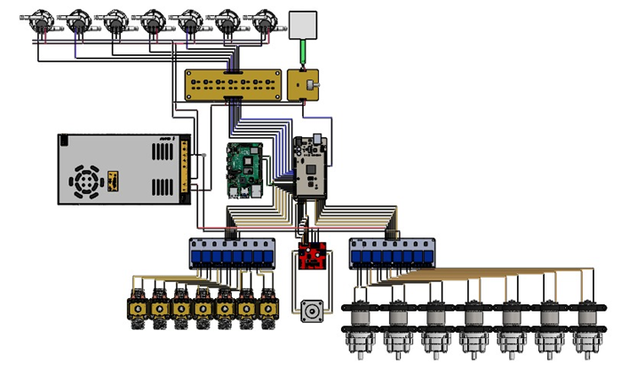
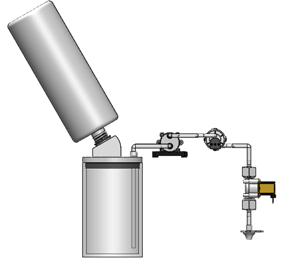
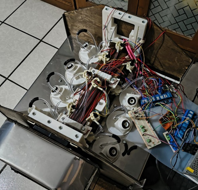
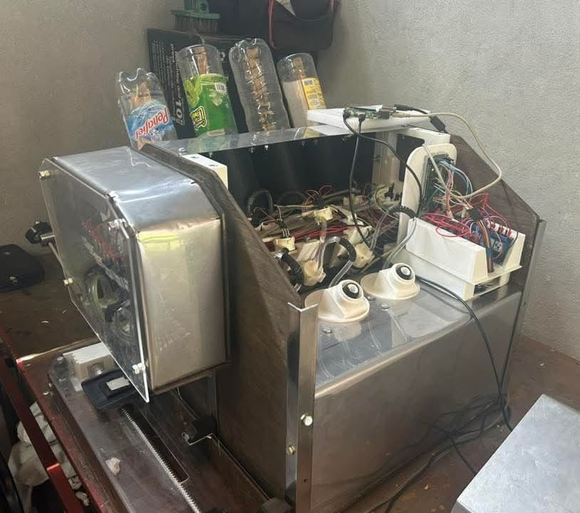

# SISTEMA SEMIAUTOMÁTICO DE PREPARACIÓN DE BEBIDAS CON LA COMBINACIÓN DE TRES INGREDIENTES UTILIZANDO TECNOLOGÍAS IoT

**Thesis Project | UPIITA - IPN | 2023-2025**

Automated beverage preparation system combining up to three ingredients per recipe. A NEMA stepper motor positions a dispensing platform across three stations; peristaltic pumps and solenoid valves dispense each ingredient with flow-sensor feedback. An Arduino Mega handles all hardware control and communicates over UART with a Raspberry Pi running a Flask web server, which exposes a user-facing ordering interface and an operator dashboard, accessible remotely via Cloudflare Tunnel.

---

## Architecture

```
User / Operator (Browser)
        |
   Cloudflare Tunnel
        |
   Raspberry Pi
   └── Flask (app.py)
       ├── Ordering frontend  (index.html)
       ├── Operator dashboard (dashboard.html)
       ├── Recipe registry    (recetas.py)
       ├── SQLite DB          (pedidos_locales.txt)
       └── Serial (UART / JSON)
               |
         Arduino Mega
         ├── Stepper driver TB6600  → Platform positioning (3 stations)
         ├── Peristaltic pumps x7   → Ingredient dispensing
         ├── Solenoid valves x7     → Flow control
         ├── Flow sensors x7        → Volume feedback (interrupt-driven)
         └── FSR-406                → Cup presence detection
```

---

## Hardware

| Component | Role |
|---|---|
| Raspberry Pi | Web server, order management, serial coordinator |
| Arduino Mega | Real-time hardware control |
| NEMA Stepper + TB6600 | Platform positioning across 3 dispensing stations |
| Peristaltic pumps x7 | Ingredient dispensing |
| Solenoid valves x7 | Flow control per ingredient |
| Flow sensors x7 | Pulse-based volume measurement |
| FSR-406 | Cup presence detection |

**Ingredients supported:** Mineral water, lemon juice, orange juice, natural syrup, gin, white tequila, white rum.

---

## Firmware

Written in C++ for Arduino Mega:

| File | Description |
|---|---|
| `Prue_Web_IoT_270625.ino` | Main entry point. Pin definitions, setup, serial loop |
| `prepBeb.ino` | Recipe lookup and sequential ingredient dispensing |
| `movNema.ino` | Stepper motor positioning between stations 1-3 |
| `valorDispensado.ino` | Interrupt-driven flow sensor pulse counting and volume control |
| `Externas.ino` | FSR cup detection, JSON error/confirmation responses, ingredient-to-pin mapping |
| `RecBebidas.ino` | Recipe registry (16 recipes) and lookup function |
| `IngBebidas.ino` | Ingredient definitions per recipe |
| `setupPins.ino` | GPIO configuration |
| `webSocket.ino` | Serial state reporting (placeholder, not active in production) |
| `ESTRUCTURAS.h` | `Ingrediente` and `Receta` struct definitions |

**Communication protocol:** Arduino receives JSON over UART (`{"Nombre": "MOJITO", "Cantidad": 1}`), executes the recipe, and responds with `{"ok": true}` or `{"error": "..."}`.

**Volume control:** Flow sensors are read via hardware interrupts. Dispensing stops when accumulated pulse count reaches the target volume (`mlPorPulso = 0.48 ml/pulse`), achieving a minimum dosing error of 5% across 40 validated test cycles.

---

## Web Application

| File | Description |
|---|---|
| `app.py` | Flask server, serial communication handler, order routing |
| `recetas.py` | Recipe registry mirrored from firmware, used for order validation |
| `logs.py` | Terminal message formatting |
| `pedidos_locales.txt` | SQLite order log |
| `templates/index.html` | Customer-facing ordering interface |
| `templates/dashboard.html` | Operator monitoring dashboard |
| `templates/info.html` | Beverage information page |

Remote access is handled via Cloudflare Tunnel, exposing the Flask server without opening additional ports.

---

## Recipes (16)

Non-alcoholic: Limonada, Naranjada, Virgin Margarita, Citrus Punch

Gin-based: Mojito, John Collins, Shady Grove

Tequila-based: Bulldog, Margarita, Tequila Sunrise, Agave Julep, Changuirongo, Alamo Splash

Rum-based: Boston Cooler, Suzie Taylor, Daiquiri

---

## Mechanical Design

Visualization STL files are located in `/mechanical-designs`.

---

## Gallery
 
| | |
|---|---|
| Original Design  | Final Design |
| Custom Electronics  | Liquid Transfer System |
| Building Process | Testing  |
 
---

## Authors

Jorge Andrés Conde Jaimes, Luis Alberto Peréz Sanchéz, Antonio Roldán Gabriel

UPIITA - Instituto Politécnico Nacional | 2023-2025

## Acknowledgements

Project advisor 1: Dr. Mata Machuca Juan Luis, UPIITA - IPN
Project advisor 2: M. Navarrete Manzanilla Niels Henrik, UPIITA - IPN